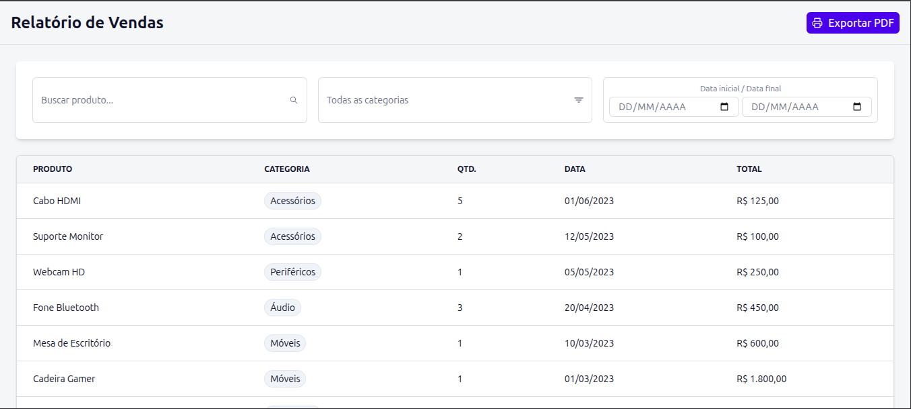
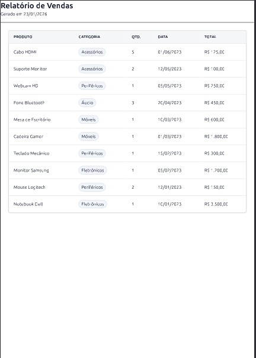

# 📊 Relatório de Vendas — Frontend

Frontend de uma aplicação simples de **Relatório de Vendas**, desenvolvida como parte de uma **etapa de teste técnico**. A aplicação permite visualizar os dados de vendas e gerar um **relatório em PDF**.

---

## Sobre o projeto

Este projeto tem como objetivo demonstrar:

* Organização de código no frontend
* Consumo e exibição de dados
* Geração de relatório em PDF
* Simplicidade e clareza na interface

---

## Tecnologias utilizadas

* React
* Vite
* TypeScript
* Tailwind CSS
* Tanstack query
* Tanstack table
* Axios

---

## Como executar o projeto

### Pré-requisitos

* Node.js (versão 18 ou superior)
* npm ou yarn

⚠️ Importante: Para que as informações de vendas sejam exibidas na interface, é necessário que o backend desenvolvido esteja em execução na máquina.

### Passos

```bash
# Clone o repositório
git clone <URL_DO_REPOSITORIO>

# Acesse a pasta do projeto
cd nome-do-projeto

# Instale as dependências
npm install

# Execute a aplicação
npm run dev
```

A aplicação estará disponível em:

```
http://localhost:5173
```

---

## Interface da aplicação

Tela principal do relatório de vendas:



---

## Relatório em PDF

Exemplo do PDF gerado pela aplicação:



---

## Observações

* Projeto desenvolvido exclusivamente para fins de avaliação técnica
* Os dados apresentados são fictícios
* O foco está na funcionalidade e clareza do código

---

## Autor

**Breno Mateus**
